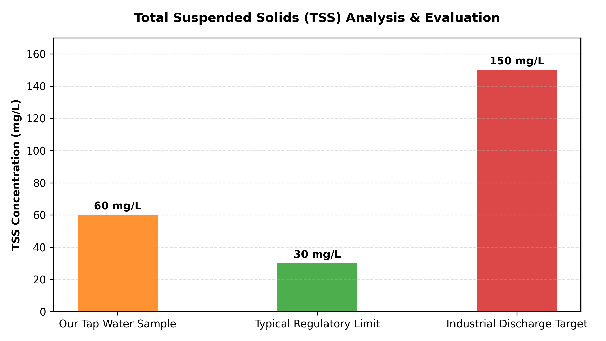

# Project: Total Suspended Solids (TSS) Gravimetric Analysis

## Introduction
This project assesses the physical quality of a water sample by measuring the concentration of Total Suspended Solids (TSS). Tracking TSS is a fundamental operation in water engineering because suspended matter increases turbidity, degrades aquatic habitats, and physically shields pathogenic bacteria from disinfectant chemicals like chlorine or UV light.

## The Lab Process (Gravimetric Method)
1. **Filter Conditioning:** Pre-dried a clean FiltraTECH paper filter in a drying oven at 105°C for 15 minutes to eliminate ambient moisture, cooled it in a desiccator, and recorded the initial tare mass ($m_0$).
2. **Filtration:** Measured exactly 100 mL of the water sample using a graduated cylinder and passed it completely through the prepared filter setup.
3. **Drying & Post-Weighing:** Placed the wet filter containing the trapped particulates back into the 105°C oven for 30 minutes. Transferred it back into the desiccator to cool down to room temperature to avoid atmospheric moisture interference, and weighed it to find the final mass ($m_1$).

---

## Technical Specifications & Formulas
- **Filter Type:** FiltraTECH paper filter (Ref: QT45A0110, &Oslash; 110 mm)
- **Drying Equipment:** Temperature-regulated laboratory oven set to 105°C
- **Measurement Device:** High-precision analytical balance (Sensitivity: 0.0001 g)

The calculation uses the difference between the dry weight of the filter before and after filtration:

$$\text{TSS}(\text{mg/L})=\frac{(m_1-m_0)\times1000}{\text{V}_{\text{sample}}}$$

---

## Results & Data

| Parameter | Value | Unit |
| :--- | :---: | :---: |
| Filter Tare Mass ($m_0$) | 0.7600 | grams |
| Dried Filter + Residue Mass ($m_1$) | 0.7660 | grams |
| Net Mass of Retained Solids ($m_1-m_0$) | 0.0060 | grams |
| Sample Volume ($V$) | 100 | mL |
| **Final TSS Concentration** | **0.06 (60)** | **g/L (mg/L)** |

---

## Evaluation Chart

---

## Critical Evaluation & Environmental Impact
* **Analysis of Value:** The analysis yielded a solid mass concentration of 60 mg/L. While this indicates a relatively low overall sediment load, it highlights the clear necessity of implementing clarifying processes (like coagulation/flocculation) before running downstream disinfection loops.
* **Operational Vulnerabilities:** Gravimetric analysis demands tight procedural control. Key experimental errors encountered during testing include tracking incomplete drying cycles (which falsely spikes weight via lingering water molecules), manual handling contamination without micro-forceps, and balance calibration drifts.
