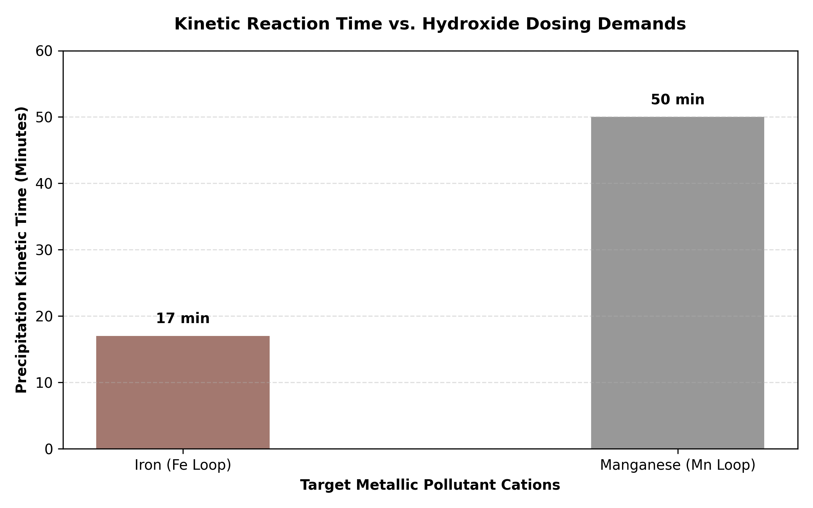

# Project: Iron (Fe) & Manganese (Mn) Removal Study

## Introduction
Iron ($Fe$) and Manganese ($Mn$) are among the most common metallic contaminants found in natural water resources, particularly within deep groundwater aquifers. When concentrations surpass strict regulatory thresholds, they degrade organoleptic quality by introducing a bitter metallic taste, discoloring the water matrix, and generating thick chemical scaling deposits inside industrial distribution grids. 

This project explores the sequential multi-stage chemical removal loop—**Oxidation, Insoluble Precipitation, and Mechanical Filtration**—required to satisfy potable water standards.

---

## Chemical Principles & Reaction Pathways

The elimination process relies on converting highly soluble reduced cations ($Fe^{2+}$ and $Mn^{2+}$) into completely insoluble oxidized operational forms ($Fe(OH)_3$ and $MnO_2$) that can be physically strained out of the matrix.

### 1. Iron (Fe) Removal Loop
Dissolved iron typically persists as the ferrous cation ($Fe^{2+}$). Under basic conditions initialized by Sodium Hydroxide ($NaOH$), an aggressive oxidant like Hydrogen Peroxide ($H_2O_2$) drives immediate chemical oxidation to the ferric state ($Fe^{3+}$), resulting in a flocculated sludge blanket:

* **Oxidation Step:**
  
$$\text{Fe}^{2+}\rightarrow\text{Fe}^{3+}+\text{e}^{-}$$

* **Alkaline Precipitation Step:**
  
$$\text{Fe}^{3+}+3\text{OH}^{-}\rightarrow\text{Fe(OH)}_3\downarrow\quad\text{(Flocculated Brun-Rouge Precipitate)}$$

### 2. Manganese (Mn) Removal Loop

Manganese exists as the highly stable $Mn^{2+}$ cation. Because it features a significantly higher oxidation potential than iron, it commands a much more alkaline environment ($\text{pH}\approx 10$) and exhibits far slower reaction kinetics:

* **Simultaneous Oxidation & Precipitation:**
  
$$\text{Mn}^{2+}+\text{H}_2\text{O}_2+2\text{OH}^{-}\rightarrow\text{MnO}_2\downarrow+2\text{H}_2\text{O}\quad\text{(Colloidal Brun-Noir Precipitate)}$$

---

## Experimental Setup & Controlled Matrix

| Parameters & Measured Metrics | Iron (Fe) Assay Loop | Manganese (Mn) Assay Loop |
| :--- | :---: | :---: |
| **Initial Water Sample Volume** | $50\text{ mL}$ | $50\text{ mL}$ |
| **Doped Metal Sulfate Solution** | $15\text{ drops of }\text{FeSO}_4$ | $15\text{ drops of }\text{MnSO}_4$ |
| **Initial Background pH** | $8.00$ | $8.00$ |
| **Alkaline Target pH Adjustment** | $\text{pH}=9.29$ | $\text{pH}=10.01$ |
| **Total 0.1M NaOH Volume Added** | $25\text{ drops}$ | $33\text{ drops}$ |
| **Oxidant Dosing ($30\%\ \text{H}_2\text{O}_2$)** | $3\text{ drops}$ | $3\text{ drops}$ |
| **Kinetic Precipitation Time** | $17\text{ Minutes}$ | $50\text{ Minutes}$ |

---

## Performance Evaluation Chart

---

## Comparative Data Analysis

The experimental parameters confirm critical kinetic disparities between the two target metal species:

1. **Kinetic Disparity:** Iron oxidizes and aggregates rapidly, generating massive, heavy flocs within 17 minutes. Conversely, Manganese exhibits a severely retarded kinetic rate, requiring 50 minutes to complete precipitation despite a higher chemical concentration of alkaline drivers.
2. **Filtration Efficiency:** * **Iron:** Straining through standard FiltraTECH paper filters yielded a completely clear, crystal-clear filtrate. The heavy macro-flocs of $\text{Fe(OH)}_3$ were entirely retained by the filter matrix pores.
   * **Manganese:** The filtered water remained distinctly turbid and cloudy. Because $\text{MnO}_2$ forms incredibly fine, highly stable colloidal structures, the particles physically slipped through standard filter sheets. This proves that straightforward sedimentation and standard gravity filtration are insufficient for manganese loops without preceding coagulant/flocculant additions.

---

## Industrial Plant Scaling Architecture

At an industrial treatment plant scale, gravity-fed well water undergoes structured processing blocks to hit compliance standards ($\text{Fe} < 0.2\text{ mg/L}; \text{Mn} < 0.05\text{ mg/L}$):

1. **Forced Aeration / Chemical Dosing Towers:** Raw groundwater is sprayed through cascading aeration columns to stripping volatile compounds and dissolve ambient oxygen. Strong chemical oxidative agents—such as Chlorine gas ($\text{Cl}_2$), Potassium Permanganate ($\text{KMnO}_4$), or Ozone ($\text{O}_3$)—are mechanically injected to force rapid electron transfer.
2. **Coagulation-Flocculation Tanks:** Because manganese precipitates are colloidal, coagulants like Aluminum Sulfate ($\text{Al}_2(\text{SO}_4)_3$) or Ferric Chloride ($\text{FeCl}_3$) are flash-mixed into the flow stream. This destabilizes surface electrical charges, prompting the ultra-fine colloids to bind together into dense, settleable flocs.
3. **Clarification and Dual-Media Beds:** Heavy flocs settle by gravity in sedimentation basins. Pinpoint escaping particulates are subsequently captured by passing down through multi-tier deep granular beds consisting of high-density Sand, Anthracite, or catalytic Manganese Dioxide greensand media.
