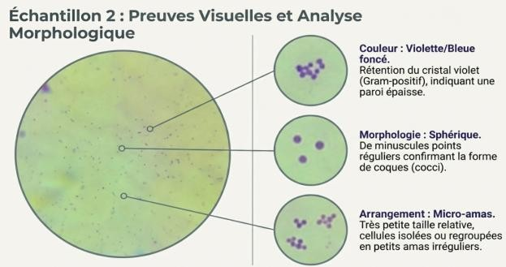
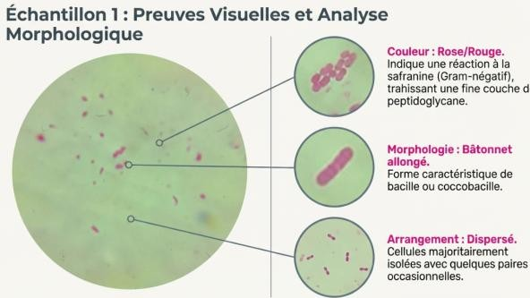

# Lab 07: Bacterial Identification via Gram Staining

## Objective
To master the differential Gram staining technique and characterize the morphology of bacterial strains.

## Principles
The Gram stain differentiates bacteria based on cell wall structure:
* **Gram-positive:** Thick peptidoglycan layer retains the primary crystal violet stain (Purple).
* **Gram-negative:** Thin peptidoglycan layer and outer membrane (Pink/Red).

## Gram Staining Procedure (Analytical Flow)

1. **Smear Preparation:** Heat-fix bacterial sample on a glass slide.
2. **Primary Stain (Crystal Violet):** 1 min (Colors all cells purple).
3. **Mordant (Iodine):** 1 min (Sets the dye in Gram+ cell walls).
4. **Decolorization (Alcohol/Acetone):** 5-10 sec (Crucial step: Gram- cells turn colorless).
5. **Counterstain (Safranin/Fuchsin):** 30 sec (Colors Gram- cells pink/red).
6. **Microscopy:** Observation under $100\times$ oil immersion.

## Microscopic Results
Observations under $100\times$ oil immersion:

| Gram-Positive (Purple) | Gram-Negative (Pink/Red) |
| :---: | :---: |
|  |  |

## Engineering Significance
Correct identification of bacterial morphology and wall structure is a prerequisite for environmental diagnostics. Gram-negative bacteria often possess outer membranes that confer higher resistance to standard disinfection methods (e.g., Chlorine), requiring specialized engineering considerations for water treatment plant protocols.
