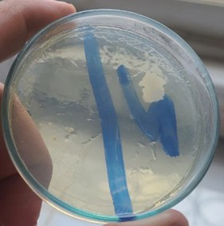

# Lab 08: Monitoring of Environmental & Cutaneous Flora

## Objective
To quantify microbial contamination in indoor air (sedimentation) and on human skin (fingerprint method) to demonstrate the efficacy of hand hygiene.

## Experimental Observations
We evaluated microbial presence using two methods:
1. **Airborne Load:** Passive sedimentation over 10 minutes.
   
 

2. **Cutaneous Load:** Fingerprint comparison of non-disinfected vs. disinfected skin.
   
    

| Test Method | Observation | Evidence |
| :--- | :--- | :--- |
| **Air Sedimentation** | 9 Colonies / 10 min | (air bacteria.jpg) |
| **Fingerprint (Hand Hygiene)** | Significant reduction post-disinfection | (clean_unclean finger bacteria.jpg) |

## Experimental Narrative
The air test established a baseline environmental microbial load of 9 CFU/10 min. The fingerprint test provided a clear visual comparison: the "unclean" finger showed high microbial density, while the "disinfected" finger confirmed the efficacy of our hygiene protocol.

## Conclusion
This lab experiment illustrates the critical importance of aseptic technique in laboratory environments. The results confirm that hand hygiene is a vital barrier against cross-contamination, a fundamental principle for any environmental engineering laboratory.
