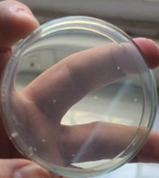

# Lab 08: Monitoring of Environmental & Cutaneous Flora

## Objective
To quantify microbial contamination and evaluate the efficacy of aseptic hand hygiene practices.

## Morphological Comparison & Quantitative Data
We performed a comparative analysis between non-disinfected and disinfected samples. The following table correlates the visual morphology with the quantitative results:

| Test Method | Colony Count | Morphology (Shape/Texture) | Evidence |
| :--- | :---: | :--- | :--- |
| **Air Sedimentation** | 9 CFU/10 min | Small, punctiform, circular |  |
| **Pre-Disinfection** | High Count | Mucoid, large, convex, cream/yellow |  |
| **Post-Disinfection** | 0-1 CFU | None observed |  |

## Biological Mechanism of Hygiene
* **Transient vs. Resident Flora:** The diverse morphology (varying colors and textures) seen in the pre-disinfection fingerprint represents transient flora. These colonies are large and mucoid because they have had sufficient surface area and nutrients on the skin to develop.
* **Mechanism of Action:** Ethanol disrupts the lipid bilayer and denatures proteins. The visual "disappearance" of the colonies after disinfection confirms cell lysis.
* **Environmental Load:** The air test results (9 CFU/10 min) reveal a consistent microbial "background" in the lab. These are typically environmental bacteria (often *Bacillus* species or staphylococci) adapted to air-borne suspension.

## Conclusion
The data proves a direct correlation between alcohol-based disinfection and the reduction of microbial colony volume. The morphological shift from dense, mucoid growth to zero growth provides scientific validation of the aseptic protocol.
