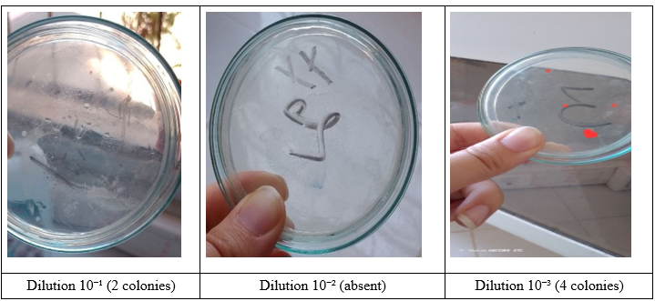

# Lab 09: Microbiological Water Quality (Tamarza Source)

## Objective
To quantify the Total Aerobic Mesophilic Flora (FAMT) in the Tamarza water source and evaluate its bacteriological safety.

## Experimental Observations
The sample underwent a decimal dilution series. Results were as follows:

| Dilution Factor | Observed Colony Count (CFU) | Observation Notes |
| :--- | :---: | :--- |
| $10^{-1}$ | Visible growth | High density of colonies |
| **$10^{-2}$** | **0** | No visible growth observed |
| **$10^{-3}$** | **4** | Isolated, discrete colonies |

### Evidence
The plate at $10^{-3}$ confirms the presence of active flora, while the unexpected clarity of the $10^{-2}$ dilution is noted for further analysis:

## Calculations
Using the countable $10^{-3}$ dilution for quantification:

$$\text{CFU/mL} = \frac{N}{V \times d} = \frac{4}{0.1 \times 10^{-3}} = 4 \times 10^4 \text{ CFU/mL}$$

## Engineering Interpretation & Procedural Analysis
* **Data Anomaly:** The absence of growth in the $10^{-2}$ dilution, despite growth in both $10^{-1}$ and $10^{-3}$, is an experimental anomaly. This may be due to uneven distribution during the spread plate technique or localized inhibition on the $10^{-2}$ plate.
* **Biological Inference:** Despite the anomaly, the consistent growth at the other dilutions confirms the presence of mesophilic bacteria at a concentration of $4 \times 10^4 \text{ CFU/mL}$.
* **Safety Conclusion:** This count remains well above the potability limit ($< 10^2 \text{ CFU/mL}$). The Tamarza source requires disinfection (e.g., chlorination/UV) prior to distribution to effectively neutralize these mesophilic populations.

## Conclusion
The experiment provides clear evidence that the water source is biologically active. The procedural discrepancy at $10^{-2}$ serves as a reminder of the sensitivity of microbiological plating, but the overall quantification confirms that the water is not safe for direct consumption without treatment.
