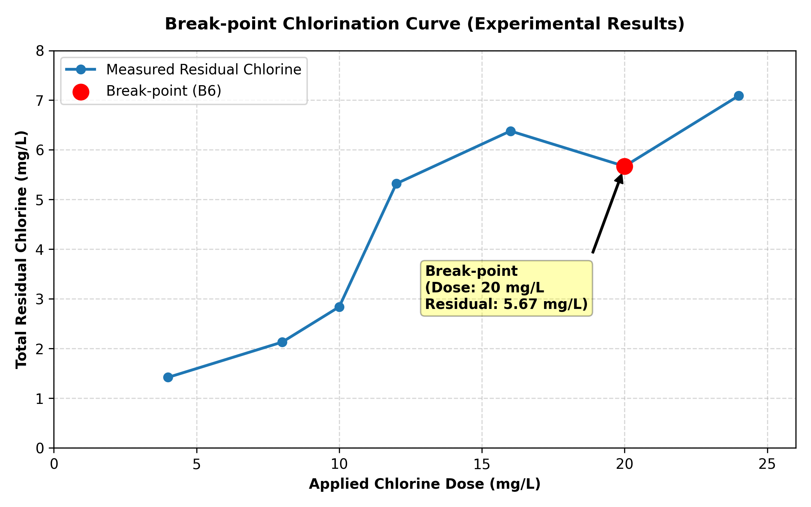

# Project 2: Break-point Chlorination Study

## Introduction
This study investigates the behavior of chlorine when added to a water sample (tap water) to determine the exact "break-point". The goal is to find the minimum dose required to satisfy the water's chemical demand and ensure a stable residual for disinfection.

## The Lab Process
1. **Preparation:** Prepared 7 beakers with 250 mL of tap water each.
2. **Dosing:** Added increasing volumes of a 1000 mg/L Sodium Hypochlorite (NaOCl) solution to reach doses ranging from 4 mg/L to 24 mg/L.
3. **Contact Time:** Samples were agitated for 15 minutes to allow the chlorine to react with organic and nitrogenous matter.
4. **Iodometric Titration:** Used a back-titration method to measure the Total Residual Chlorine:
    * Added Potassium Iodide (KI) and Acetic Acid to release Iodine (I2).
    * Titrated with Sodium Thiosulfate (Na2S2O3) using a starch indicator until the blue color disappeared.

---

## Chemical Reactions

**1. Formation of Hypochlorous Acid:**

$$\text{NaOCl}+\text{H}_2\text{O}\rightarrow\text{HOCl}+\text{NaOH}$$

**2. Titration Step 1 (Oxidation of Iodide):**

$$\text{HOCl}+2\text{KI}+\text{CH}_3\text{COOH}\rightarrow\text{I}_2+\text{KCl}+\text{CH}_3\text{COOK}+\text{H}_2\text{O}$$

**3. Titration Step 2 (Reduction of Iodine):**

$$\text{I}_2+2\text{Na}_2\text{S}_2\text{O}_3\rightarrow\text{Na}_2\text{S}_4\text{O}_6+2\text{NaI}$$

---

## Results & Data Table

| Sample | Applied Dose (mg/L) | V_thio (mL) | Residual Chlorine (mg/L) | Chlorine Demand (mg/L) |
| :--- | :---: | :---: | :---: | :---: |
| B1 | 4 | 0.4 | 1.42 | 2.58 |
| B2 | 8 | 0.6 | 2.13 | 5.87 |
| B3 | 10 | 0.8 | 2.84 | 7.16 |
| B4 | 12 | 1.5 | 5.32 | 6.68 |
| B5 | 16 | 1.8 | 6.38 | 9.62 |
| **B6 (Break-point)** | **20** | **1.6** | **5.67** | **14.33** |
| B7 | 24 | 2.0 | 7.09 | 16.91 |

---

## Technical Calculations

The concentration of Total Residual Chlorine is determined by the equivalence relationship during the iodometric titration:

$$\text{N}_{\text{thio}}\times\text{V}_{\text{thio}}=\text{N}_{\text{Cl}_2}\times\text{V}_{\text{sample}}$$

Expressing this explicitly to solve for mass concentration yields the operational calculation formula:

$$\text{C}_{\text{Residual}}(\text{mg/L})=\frac{\text{V}_{\text{thio}}\times\text{N}_{\text{thio}}\times\text{M}_{\text{eq}}(\text{Cl}_2)\times1000}{\text{V}_{\text{sample}}}$$

Where:
* $\text{V}_{\text{thio}}$ : Volume of sodium thiosulfate used (mL)
* $\text{N}_{\text{thio}}$ : Normality of thiosulfate solution ($0.01\text{ N}$)
* $\text{M}_{\text{eq}}(\text{Cl}_2)$ : Equivalent weight of chlorine ($35.45\text{ g/eq}$)
* $\text{V}_{\text{sample}}$ : Volume of water sample analyzed ($100\text{ mL}$)

---
## Experimental Curve

## Analysis of the Curve
The experimental data reveals the four classic zones of chlorination:

1. **Initial Consumption:** The chlorine is immediately consumed by reducing agents (like Fe2+ or Mn2+).
2. **Chloramine Formation:** The residual begins to rise as chlorine reacts with nitrogenous compounds to form chloramines.
3. **The Destruction Zone:** Between B5 and B6, the residual unexpectedly **drops**. This confirms the destruction of chloramines by the excess chlorine.
4. **The Break-point (B6):** At a dose of 20 mg/L, the demand is fully satisfied. Any chlorine added after this point (B7) results in a linear increase in free residual chlorine.

---

## Conclusion
The water analyzed has a total chlorine demand of **14.33 mg/L**. Determining this point is essential for water safety; it ensures that the dose is high enough to maintain a protective residual in the distribution network without creating excessive disinfection by-products.
