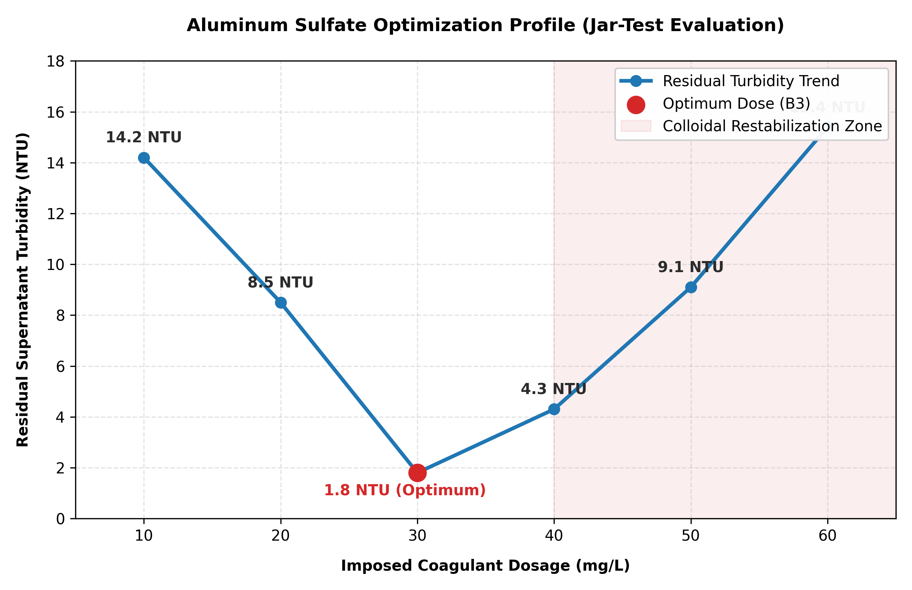

# Project : Coagulation-Flocculation Optimization via Jar-Testing

## Introduction
Surface water resources frequently carry high levels of colloidal stability, resulting in elevated turbidity caused by microscopic suspended particles (such as clays, silts, and organic matter). Because these fine particles carry negative surface electrical charges, they naturally repel each other and remain permanently suspended in water, making simple gravity sedimentation impossible.

This project demonstrates the classic **Jar-Test procedure**, an essential industrial unit operation used to determine the optimum chemical dosage of an aluminum sulfate coagulant. The objective is to destabilize particle charges, promote micro-floc aggregation, and achieve maximum turbidity removal at minimal operational cost.

---

## Technical Principles & Mechanics

Coagulation-flocculation operates through a sequence of distinct physical and chemical mechanisms:

1. **Charge Neutralization (Fast Mixing):** The injection of a trivalent cationic coagulant, Aluminum Sulfate $\text{Al}_2(\text{SO}_4)_3$, introduces highly charged $\text{Al}^{3+}$ species. Flash mixing rapidly compresses the electrical double layer surrounding the negative colloids, neutralizing their surface charges and allowing them to adhere upon impact.
2. **Bridging & Aggregation (Slow Mixing):** Gentle agitation slows the matrix down, allowing neutralized micro-flocs to collide and physically bind into large, dense macro-flocs (sludge blankets) suitable for rapid settling.

The efficiency of the treatment process is mathematically quantified by calculating the residual **Turbidity Removal Efficiency ($R$ or $\eta$)**:

$$\eta = \frac{\text{Turbidity}_0 - \text{Turbidity}_f}{\text{Turbidity}_0} \times 100$$

Where:
* $\text{Turbidity}_0$ : Raw water input turbidity ($\text{NTU}$)
* $\text{Turbidity}_f$ : Supernatant residual turbidity measured after sedimentation ($\text{NTU}$)

---

## Experimental Setup & Operational Timeline
The laboratory configuration uses a standard multi-place jar-test apparatus to evaluate six parallel water samples under identical kinetic constraints:

* **Matrix Volume:** $500\text{ mL}$ of raw surface water per beaker.
* **Coagulant stock solution:** $10\text{ g/L}$ Aluminum Sulfate ($\text{Al}_2(\text{SO}_4)_3$).
* **Rapid Mixing Phase:** $100\text{ rpm}$ for $2\text{ minutes}$ (Immediate chemical flash dispersion).
* **Slow Flocculation Phase:** $30\text{ rpm}$ for $20\text{ minutes}$ (Promotes inter-particle collision without shear tearing).
* **Sedimentation Phase:** Static rest for $20\text{ minutes}$ (Gravity-driven phase separation).

---

## Results & Operational Data Matrix

| Beaker/Jar ID | Coagulant Volume (mL) | Imposed Dose (mg/L) | Residual Turbidity (NTU) | Floc Settling Performance Rating |
| :--- | :---: | :---: | :---: | :--- |
| **B1** | 0.5 | 10 | 14.2 | Poor, tiny diffuse pins in suspension |
| **B2** | 1.0 | 20 | 8.5 | Moderate clarification |
| **B3 (Optimum)** | **1.5** | **30** | **1.8** | **Excellent, large heavy flocs, clear supernatant** |
| **B4** | 2.0 | 40 | 4.3 | Good, but minor residual pin-flocs remaining |
| **B5** | 2.5 | 50 | 9.1 | Turbidity rising, light colloid restabilization |
| **B6** | 3.0 | 60 | 15.4 | Cloudy matrix, definitive restabilization effect |

---

## Performance Evaluation Curve

---

## Technical Data Interpretation & Process Kinetics

The experimental curve displays a classic asymmetric parabolic profile, tracking three distinct physicochemical operational kinetic zones based on the concentration of available coagulant ions:

### 1. Zone of Insufficient Neutralization (Under-Dosing: 10–20 mg/L)
* **Observed Data:** At $10\text{ mg/L}$ and $20\text{ mg/L}$, residual supernatant turbidity remains highly elevated at $14.2\text{ NTU}$ and $8.5\text{ NTU}$ respectively.
* **Molecular Kinetics:** The concentration of trivalent aluminum species ($\text{Al}^{3+}$, $\text{Al(OH)}^{2+}$, and polynuclear hydroxo-complexes) is too low to adequately compress the electrical double layer of the negative colloidal suspension. Because the net zeta potential remains highly negative, the electrostatic repulsion forces (Van der Waals vs. Coulombic balance) prevent particle collision. The flocs formed here are tiny, lightweight "pin-flocs" that lack the structural mass to settle within the designated 20-minute static window.

### 2. Zone of Ideal Charge Neutralization (Optimum Window: 30 mg/L)
* **Observed Data:** At exactly $30\text{ mg/L}$, residual turbidity reaches a clear minimum of **$1.8\text{ NTU}$**.
* **Molecular Kinetics:** This point represents the thermodynamic equilibrium ideal for charge neutralization. The surface charge of the suspended colloids is completely neutralized, bringing the zeta potential close to zero millivolts ($0\text{ mV}$). The micro-particles instantly aggregate during the 2-minute rapid mix. Then, during the gentle 30 rpm slow mixing phase, they form massive, heavy, branched macro-floc networks. These heavy structures easily settle out by gravity, leaving a highly polished supernatant.

### 3. Zone of Charge Reversal & Restabilization (Over-Dosing: >40 mg/L)
* **Observed Data:** Past the optimum point, the curve swings aggressively upward, with turbidity spiking back to $9.1\text{ NTU}$ at $50\text{ mg/L}$ and $15.4\text{ NTU}$ at $60\text{ mg/L}$.
* **Molecular Kinetics:** This is a classic case of **colloidal restabilization**. An excess of strongly adsorbing $\text{Al}^{3+}$ complexes saturates the active surface sites of the flocs. Instead of just neutralizing the negative charge, the excess coagulant **reverses the surface charge to a net positive value**. The particles begin repelling each other again, creating a stable, positively charged colloidal suspension. Furthermore, excess aluminum sulfate undergoes rapid hydrolysis, precipitating as fine, light aluminum hydroxide clouds ($\text{Al(OH)}_3\downarrow$) that scatter light and falsely inflate the nephelometric turbidity readings.

---

## Critical Engineering Evaluation

Looking at the experimental curve reveals a textbook **parabolic coagulation profile**, highlighting three critical operational zones:

1. **Under-Dosing Zone (10–20 mg/L):** The concentration of $\text{Al}^{3+}$ cations is insufficient to fully neutralize the negative surface charges of the colloids. Residual electrostatic repulsion keeps a significant portion of the particles suspended, resulting in poor settling and high residual turbidity ($14.2\text{ NTU}$).
2. **Optimum Economic Window (30 mg/L):** At an aluminum sulfate dose of $30\text{ mg/L}$, charge neutralization hits its thermodynamic ideal. Suspended matter completely aggregates into massive, fast-settling flocs, yielding a sparkling clear supernatant with a minimum turbidity of **$1.8\text{ NTU}$**. 
3. **Over-Dosing & Restabilization Zone (>40 mg/L):** Pushing the chemical dose past the optimum point causes a sharp increase in residual turbidity ($15.4\text{ NTU}$). This occurs because an excess of trivalent $\text{Al}^{3+}$ cations completely saturates the surfaces of the colloids, **reversing their electrical charge from negative to positive**. The particles begin repelling each other again, creating a highly stable colloidal suspension that completely ruins the clarification process.

### Industrial Plant Implication:
In a full-scale drinking water treatment plant, running exactly at the $30\text{ mg/L}$ optimum dose is highly critical. Over-dosing doesn't just waste money on chemical reagents; it physically degrades water quality and causes severe operational issues, such as short-cycling downstream sand filters and leaving trace aluminum residuals in the distribution network.
