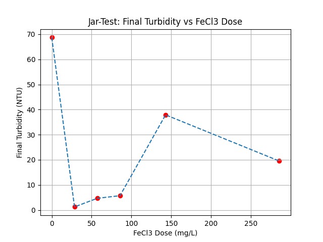

Project 1: Coagulation-Flocculation Optimization (Jar-Test)
Introduction
This project focuses on the clarification of highly turbid water using chemical coagulation. In the lab, we simulated turbid surface water using a bentonite clay suspension (128 NTU) and tested different doses of Ferric Chloride (FeCl₃) to find the exact amount needed to clear the water.
## The Lab Process

   1. Preparation: Prepared 6 beakers with 700 mL of the turbid bentonite water.
   2. Coagulation (Fast Mix): Added varying doses of FeCl₃ to beakers 1 through 5, leaving beaker 6 as a raw control sample. Agitated rapidly at 100 rpm for 2 minutes to disperse the chemical.
   3. Flocculation (Slow Mix): Slowed the agitation down to 30 rpm for 15 minutes to allow the particles to collide and grow into visible clumps (flocs).
   4. Clarification & Filtration: Allowed the flocs to settle via gravity for 30 minutes, followed by a final filtration step through paper filters.

## Chemical Reactions
When FeCl₃ hits the water, it dissociates and reacts with water molecules (hydrolysis):

FeCl₃ → Fe³⁺ + 3Cl⁻

Fe³⁺ + 3H₂O → Fe(OH)₃↓ + 3H⁺

Overall Reaction:

FeCl₃ + 3H₂O → Fe(OH)₃↓ + 3HCl

The Fe(OH)₃ forms a heavy, reddish-brown gelatinous precipitate that traps the suspended bentonite particles. Because this reaction releases hydrogen ions (H⁺), it causes a severe drop in pH as the chemical dose increases.

## Results & Data

* Initial Water Quality: pH = 7.41 | Turbidity = 128 NTU

| Sample       | FeCl₃ Vol (mL) | FeCl₃ Dose (mg/L) | Final pH | Final Turbidity (NTU) | Removal (R%) |
|--------------|----------------|-------------------|----------|-----------------------|--------------|
| B1 (Optimal) | 10             | 28.6              | 3.92     | 1.24                  | 99.0%        |
| B2           | 20             | 57.1              | 3.50     | 4.67                  | 96.3%        |
| B3           | 30             | 85.7              | 3.37     | 5.71                  | 95.5%        |
| B4           | 50             | 142.9             | 2.95     | 37.90                 | 70.4%        |
| B5           | 100            | 285.7             | 2.82     | 19.50                 | 84.8%        |
| B6 (Control) | 0              | 0.0               | 4.41     | 68.70                 | 46.3%        |

The turbidity removal efficiency was calculated using:
R (%) = [(T₀ - Tf) / T₀] × 100

## Key Findings & Discussion
* The Optimal Dose: Beaker 1 (28.6 mg/L) gave the best result, dropping the turbidity from 128 NTU down to 1.24 NTU—a massive 99% removal efficiency that easily meets clean water standards.
* The Danger of Overdosing: Pushing the dose past the optimum (Beakers 4 and 5) actually made the water cloudy again. This happens because too much coagulant restabilizes the particles and partially dissolves the flocs back into the water due to extreme acidity.
* The Acidity Problem: FeCl₃ heavily acidifies the environment. Even at the optimal dose (B1), the pH dropped hard to 3.92. In a real treatment plant, an alkaline agent (like lime or soda) would have to be added afterward to correct the pH and prevent pipe corrosion.
* Why Natural Settling Fails: The control beaker (B6), which received no chemicals, only cleared up by 46.3%. Colloidal particles like bentonite have negative surface charges that naturally repel each other, meaning they will stay suspended indefinitely without chemical intervention.
  
