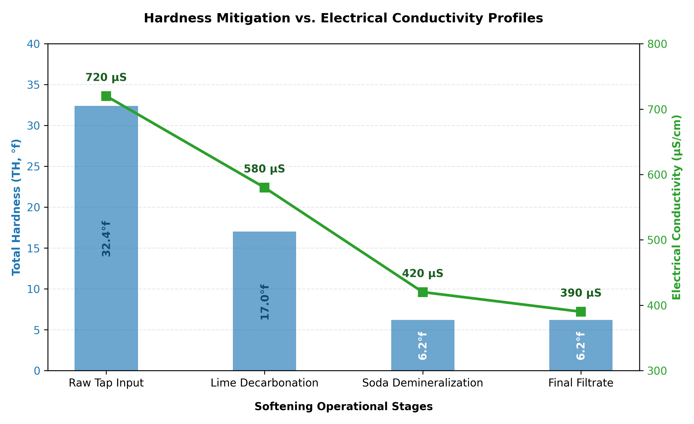

# Project 6: Water Hardness Mitigation via Lime-Soda Softening

## Introduction
Water hardness—measured as the Total Hydrotimetric Title ($\text{TH}$)—is dictated by the concentration of multivalent metallic cations dissolved in solution, predominantly Calcium ($\text{Ca}^{2+}$) and Magnesium ($\text{Mg}^{2+}$). High hardness levels trigger heavy scaling inside boilerplate systems, cooling towers, and domestic pipelines, resulting in dramatic thermal transfer inefficiencies and structural clogging.

This project demonstrates the classic **Lime-Soda Chemical Softening Process**, combining Calcium Hydroxide ($\text{Ca(OH)}_2$) and Sodium Carbonate ($\text{Na}_2\text{CO}_3$) to selectively precipitate dissolved hardness out of a tap water matrix. Multi-stage reduction performance is quantified via complexometric titrations using Ethylenediaminetetraacetic acid (EDTA).

---

## Process Chemistry & Separation Pathways

### 1. Stage 1: Lime Decarbonatation ($\text{Ca(OH)}_2$)

The addition of hydrated lime shifts the carbonate matrix equilibrium by raising the solution pH, converting soluble bicarbonates ($\text{HCO}_3^-$) into insoluble calcium carbonate, while forcing magnesium to separate as a dense hydroxide floc:

* **Calcium Temporary Hardness Elimination:**
  
$$\text{Ca(HCO}_3)_2 + \text{Ca(OH)}_2 \rightarrow 2\text{CaCO}_3\downarrow + 2\text{H}_2\text{O}$$

* **Magnesium Temporary Hardness Elimination:**
  
$$\text{Mg(HCO}_3)_2 + 2\text{Ca(OH)}_2 \rightarrow 2\text{CaCO}_3\downarrow + \text{Mg(OH)}_2\downarrow + 2\text{H}_2\text{O}$$

### 2. Stage 2: Soda Demineralization ($\text{Na}_2\text{CO}_3$)
While lime effectively mitigates temporary (carbonated) hardness, permanent hardness associated with sulfate ($\text{SO}_4^{2-}$) or chloride ($\text{Cl}^-$) anions remains untouched. Sodium carbonate is introduced to provide a high concentration of carbonate ions ($\text{CO}_3^{2-}$), forcing residual non-carbonate calcium to precipitate:

$$\text{Ca}^{2+} + \text{CO}_3^{2-} \rightarrow \text{CaCO}_3\downarrow$$
$$\text{CaSO}_4 + \text{Na}_2\text{CO}_3 \rightarrow \text{CaCO}_3\downarrow + \text{Na}_2\text{SO}_4$$

---

## Analytical Titration Mechanics
To calculate hardness levels, sample fractions are buffered to $\text{pH} \approx 10$ using Sodium Hydroxide ($\text{NaOH}$) and titrated against a standardized $0.01\text{ M}$ EDTA solution using Eriochrome Black T (EBT/NET) indicator dyes.

The fundamental governing concentration relationship is defined as:

$$\text{TH}(^\circ f) = \frac{V_{\text{EDTA}} \times C_{\text{EDTA}} \times 1000}{V_{\text{sample}}}$$

* **Initial Tap Hardness Assay:** $V_{\text{EDTA}} = 11\text{ mL} \rightarrow \text{TH} = 22^\circ f$
  
* **Post-Treatment Final Assay:** $V_{\text{EDTA}} = 5\text{ mL} \rightarrow \text{TH} = 10^\circ f$

---

## Multi-Stage Process Tracking Profile

The table below illustrates the physical chemistry transition across each treatment phase:

| Process Phase Block | Matrix pH | Electrical Conductivity ($\mu\text{S/cm}$) | Total Hardness ($\text{TH}, ^circ f$) | Physical Appearance |
| :--- | :---: | :---: | :---: | :--- |
| **Raw Input Tap Water** | $7.6$ | $720$ | $32.4^\circ f$ | Perfectly Clear & Limpide |
| **Post-Lime Decarbonatation** | $10.4$ | $580$ | $17.0^\circ f$ | Thick, Milky White Cloud |
| **Post-Soda Demineralization** | $10.8$ | $420$ | $6.2^\circ f$ | Ultra-Fine Diffuse Suspensions |
| **Final Polished Filtrate** | $9.5$ | $390$ | $6.2^\circ f$ | Restored Flawless Clarity |

---

## Performance Evaluation Chart

---

## Engineering Performance Evaluation

### 1. Hardness Removal Efficiency
The chemical loop yielded highly responsive removal yields across both stages:
* **Lime Decarbonatation Efficiency ($\eta_1$):** Achieved **$47.5\%$** mitigation ($32.4^\circ f \rightarrow 17.0^\circ f$), indicating a significant concentration of calcium and magnesium temporary hardness.
* **Soda Demineralization Efficiency ($\eta_2$):** Knocked out **$63.5\%$** of the remaining permanent components ($17.0^\circ f \rightarrow 6.2^\circ f$).
* **Cumulative Process Yield ($\eta_{\text{global}}$):** Delivered a total hardness drop of **$80.9\%$**, converting a highly scaled water source into a highly stable, soft stream ($6.2^\circ f$) suitable for industrial inputs.

### 2. Physical Phase Interferences & Limitations
While the reduction in hardness was highly successful, complete elimination ($0^\circ f$) is restricted by fundamental chemical laws:
* **Solubility Limits ($K_{sp}$):** Both $\text{CaCO}_3$ and $\text{Mg(OH)}_2$ hold non-zero solubility products ($K_{sp} \approx 3.3 \times 10^{-9}$ for calcium carbonate), leaving a permanent thermodynamic residual concentration in solution.
* **Floc Size Disparities:** The precipitates formed during the soda ash stage were incredibly fine and diffuse compared to the massive, heavy flocs generated by the lime stage. This makes simple gravity filtration slow and challenging to handle without secondary polymer aids.
* **Conductivity Dynamics:** Although total dissolved hardness ions dropped sharply, the final electrical conductivity stabilized at $390\ \mu\text{S/cm}$ due to spectator sodium ions ($\text{Na}^+$) introduced by the soda ash reagent. For ultra-pure water demands, this chemical treatment must be followed by downstream Ion-Exchange demineralization or Reverse Osmosis membranes.
