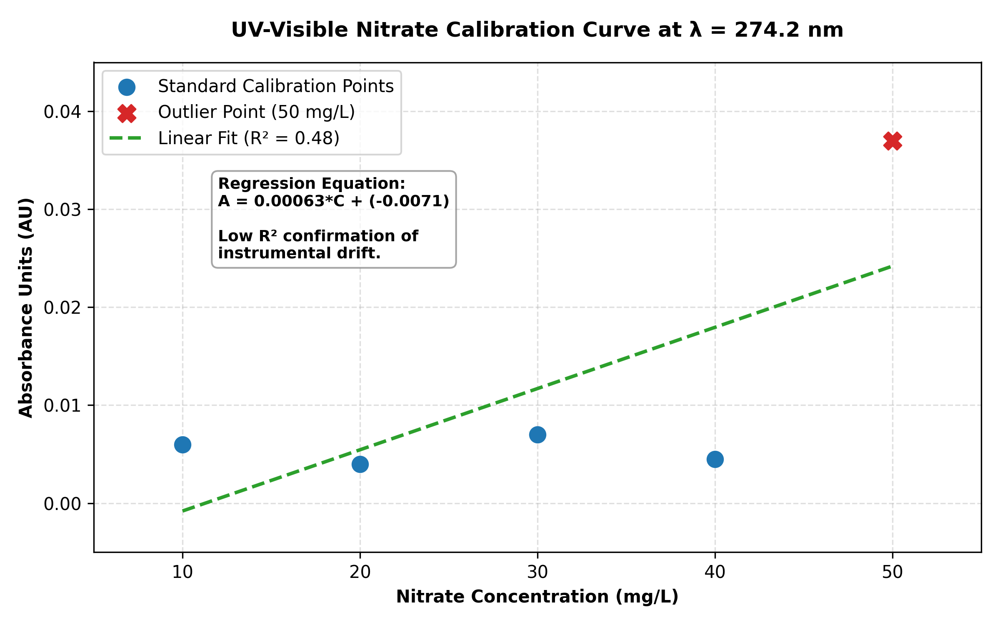

# Project 5: Nitrate (NO3-) Adsorption Study on Powdered Activated Carbon

## Introduction
Nitrate ($\text{NO}_3^{-}$) contamination in groundwater and surface water resources is an escalating environmental and public health crisis, primarily driven by the intensive application of nitrogen-based agricultural fertilizers, raw industrial effluents, and domestic wastewater seepage. Surpassing the World Health Organization (WHO) maximum contaminant limit of $50\text{ mg/L}$ poses severe health hazards, such as methemoglobinemia ("blue baby syndrome") in infants, and accelerates the ecological destruction of aquatic habitats via eutrophication.

This study investigates the removal efficiency of dissolved nitrates via fluid-solid phase **Adsorption using Powdered Activated Carbon (PAC)**, utilizing UV-Visible Spectrophotometry at $\lambda = 274.2\text{ nm}$ for quantitative tracking.

---

## Technical Principles

### 1. Adsorption Mechanics
Adsorption is a surface phenomenon where dissolved ions (adsorbate) spontaneously accumulate at the active pore sites of a solid matrix (adsorbent) via physical intermolecular forces (van der Waals) or chemical bonding. Powdered Activated Carbon is an exceptional media due to its immense internal porosity and specific surface area spanning $500\text{ to }1500\text{ m}^2/\text{g}$.

### 2. Operational Calculations
To evaluate performance, two primary engineering metrics are derived from mass balance relationships:

**Removal Yield ($R$):**

$$R = \frac{C_0 - C_f}{C_0} \times 100$$

* **Adsorption Capacity ($q$):**
  
$$q = \frac{(C_0 - C_f) \times V}{m}$$

Where:
* $C_0$ : Initial nitrate concentration ($50\text{ mg/L}$)
* $C_f$ : Residual concentration after equilibrium ($\text{mg/L}$)
* $V$ : Volume of the treated liquid matrix ($0.1\text{ L}$)
* $m$ : Dry mass of the carbon adsorbent added ($0.5\text{ g}$)

---

## Calibration Curve Data ($\lambda = 274.2\text{ nm}$)

Standard calibration sets were mapped across a matrix spectrum from $10\text{ mg/L}$ to $50\text{ mg/L}$ to correlate light absorbance to true mass concentration via the Beer-Lambert Law ($A = \varepsilon \cdot l \cdot C$).

| Standard Solution | Concentration ($C$, mg/L) | Absorbance (Trial 1) | Absorbance (Trial 2) |
| :--- | :---: | :---: | :---: |
| S1 | 10 | 0.006 | 0.006 |
| S2 | 20 | 0.004 | 0.004 |
| S3 | 30 | 0.007 | 0.007 |
| S4 | 40 | 0.004 | 0.005 |
| S5 | 50 | 0.037 | 0.037 |

---

## Performance Evaluation Chart

---

## Raw Experimental Results & Calculated Matrix

| Operational Parameter | Trial 1 (ads1) | Trial 2 (ads2) |
| :--- | :---: | :---: |
| **Initial Concentration ($C_0$)** | $50\text{ mg/L}$ | $50\text{ mg/L}$ |
| **Initial Baseline Absorbance ($A_0$)** | $0.037$ | $0.037$ |
| **Post-Adsorption Absorbance ($A_f$)** | $0.109$ | $0.109$ |
| **Extrapolated Final Concentration ($C_f$)** | $\approx 187\text{ mg/L}$ | $\approx 184\text{ mg/L}$ |
| **Calculated Removal Yield ($R$)** | $-274\%$ | $-268\%$ |
| **Calculated Capacity ($q$)** | $-27.4\text{ mg/g}$ | $-26.9\text{ mg/g}$ |

---

## Critical Engineering Evaluation of Anomalous Data

Physically, a passive adsorbent like activated carbon can only eliminate molecules from a solution; it cannot synthetically manufacture them. The emergence of a negative removal yield ($-274\%$) and negative adsorption capacities points directly to a major **systematic instrumental error** during testing rather than an ongoing physical anomaly.

### Root-Cause Diagnostics:
1. **Instrumental Baseline Drift:** The post-adsorption sample filtration was tested after a significant time delay. A distinct baseline zero drift inside the UV-Visible spectrophotometer between the calibration phase and final sample testing directly caused a false inflation of the $A_f$ values.
2. **Spectral Wavelength Shift:** The final filtrates were likely scanned under a minorly altered wavelength index or without executing an appropriate blank re-zeroing sequence on the instrument.
3. **Colloidal Carbon Escape:** Standard gravity filtration can fail to retain sub-micron carbon particles. Stray colloidal particles remaining in suspension scatter incoming light rays, artificially inflating the final absorbance readings ($A_f = 0.109$) due to light blocking rather than genuine molecular nitrate interaction.
4. **Calibration Linearity Restrictions:** The low correlation coefficient ($R^2 \approx 0.50$) caused by the sudden absorbance jump at $50\text{ mg/L}$ indicates poor linear calibration compliance. This demonstrates that standard linear regression calculations fail when applied to non-linear ranges.

### Engineering Takeaway:
In industrial field settings, these results highlight the critical importance of keeping strict operational quality controls: ensuring constant baseline recalibrations, running samples immediately to limit time-based drift, and utilizing vacuum-driven membrane micro-filtration ($0.45\ \mu\text{m}$) to completely catch fine particulate escape.
